# 高校毕业生就业服务平台

##  联系不到我，就看我的主页 
 
#### 介绍
基于SpringBoot+Vue实现的高校毕业生就业服务平台，本系统前后端分离，包含web端、管理员端、学生端、企业端，功能非常完善，代码规范整洁，运行简单，适合毕业设计以及高校就业平台搭建。

#### 软件架构
前端：vue | element-ui  
后端：springboot | mybatis  
环境：mysql | jdk1.8 | maven | node | redis      

#### 功能介绍
##### 【代码结构与数据库截图】
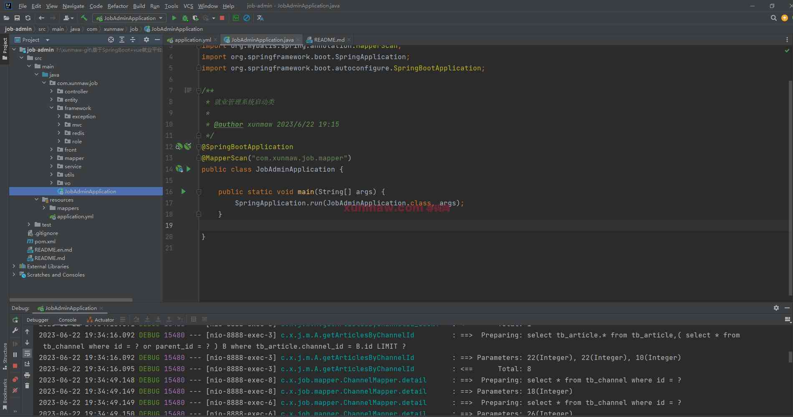 
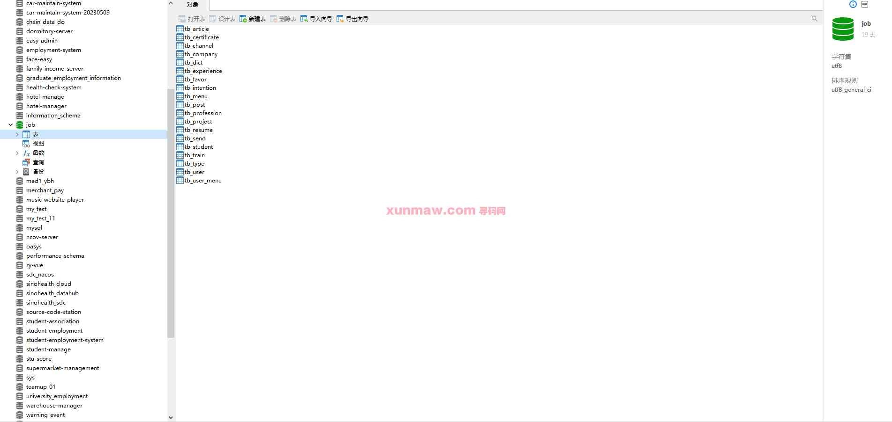  

##### 【功能详述】 
1. 首页  
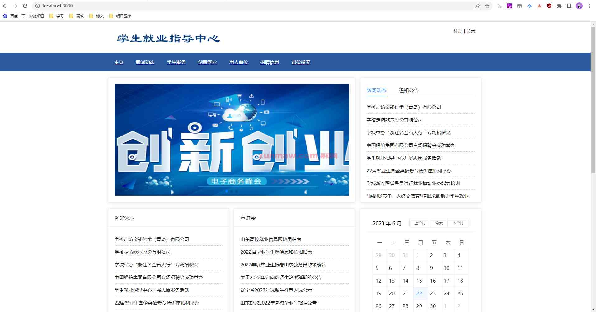

2. 登录页  
登录页分三个角色：管理员、学生、企业  
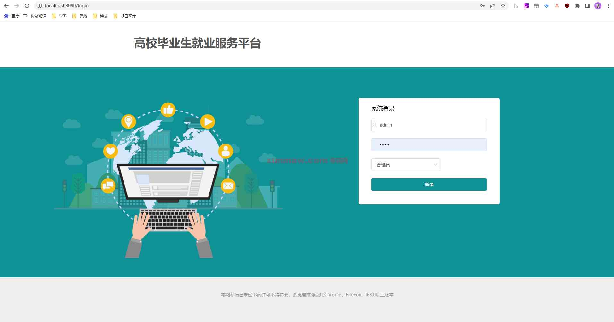

3. 管理员-首页  

4. 管理员-用户管理  
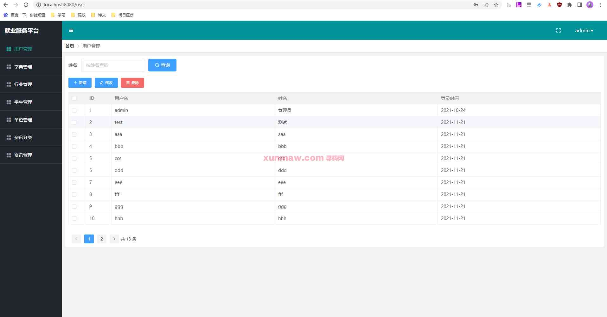

5. 管理员-字典管理  
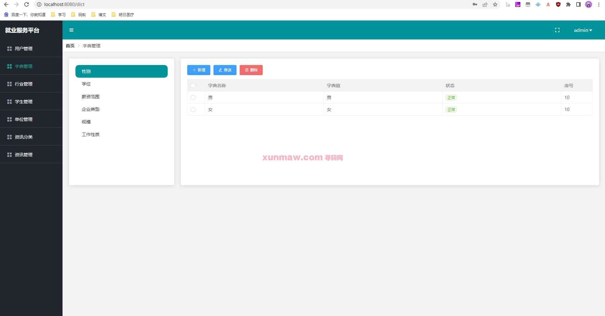

6. 管理员-行业管理  
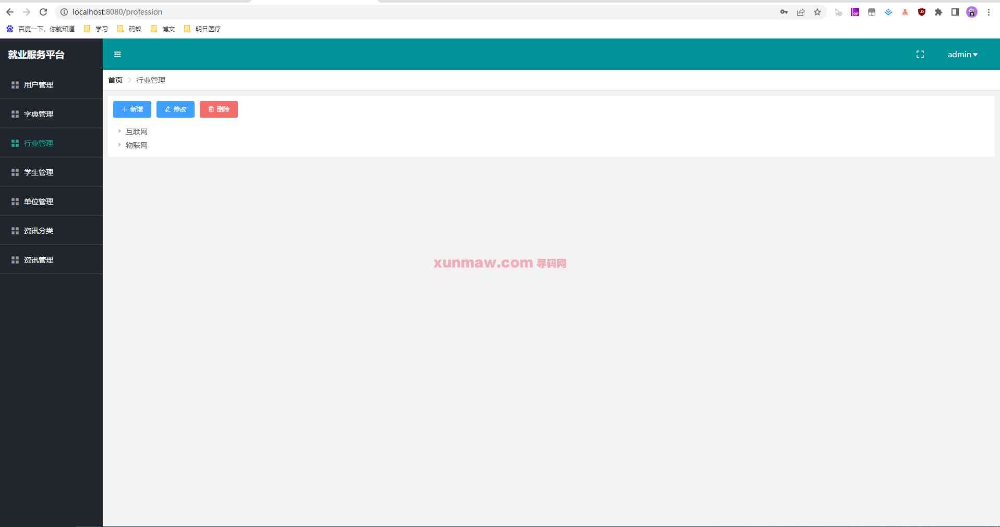

7. 管理员-学生管理  
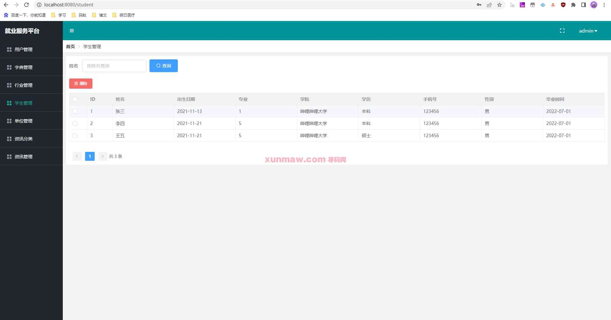

8. 管理员-单位管理  
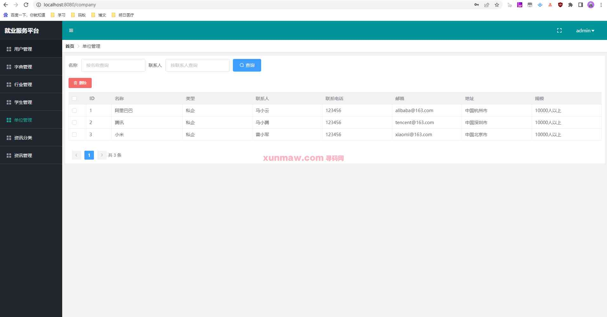

9. 管理员-资讯分类管理  
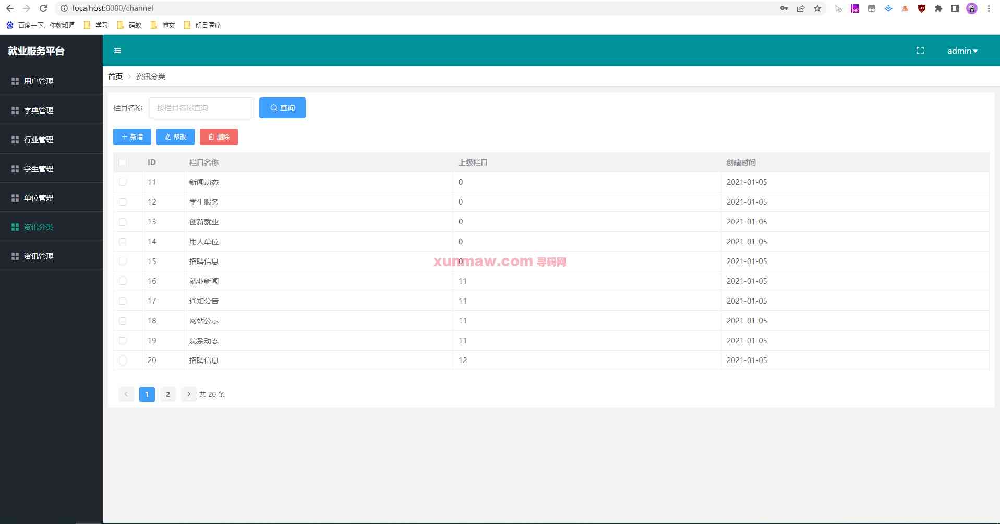

10. 管理员-资讯管理  
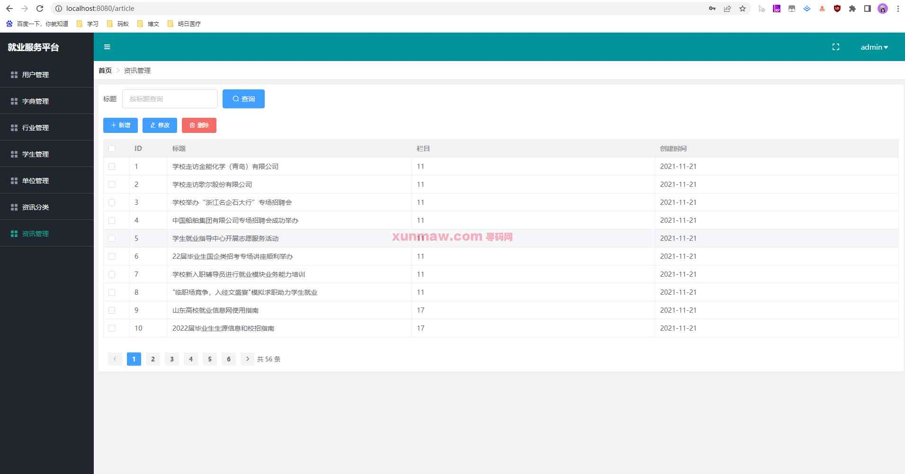

11. 企业端-基本信息  
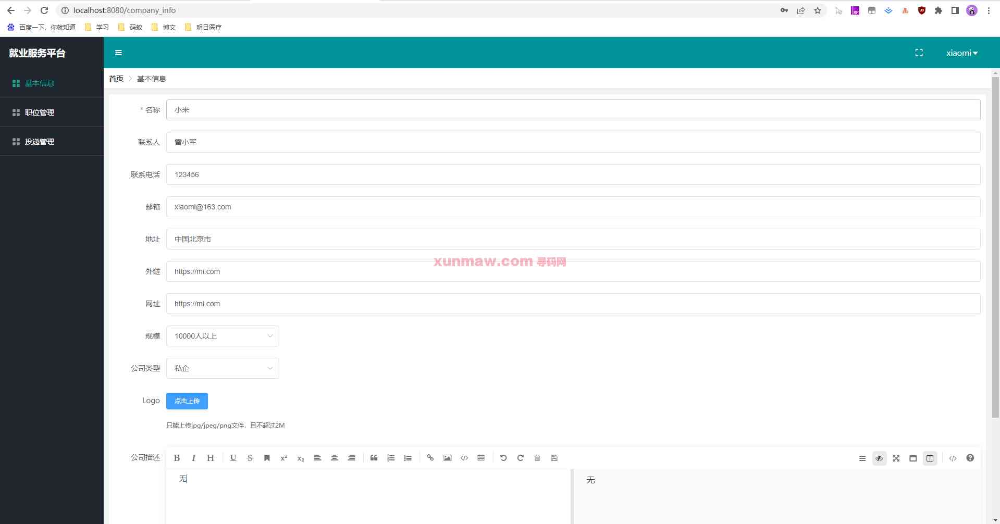

12. 企业端-职位管理  
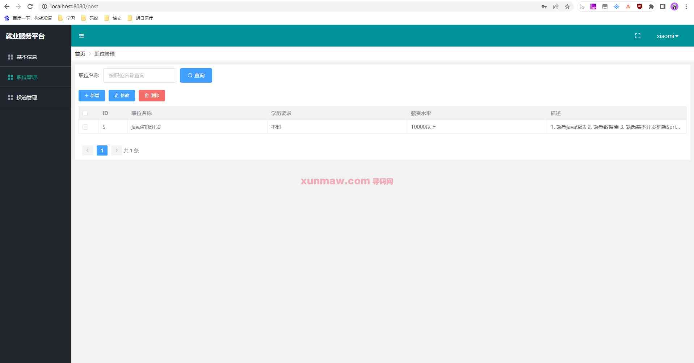

13. 企业端-投递管理  
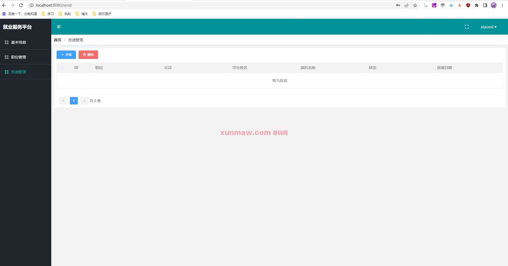

14. 学生端-基本信息  
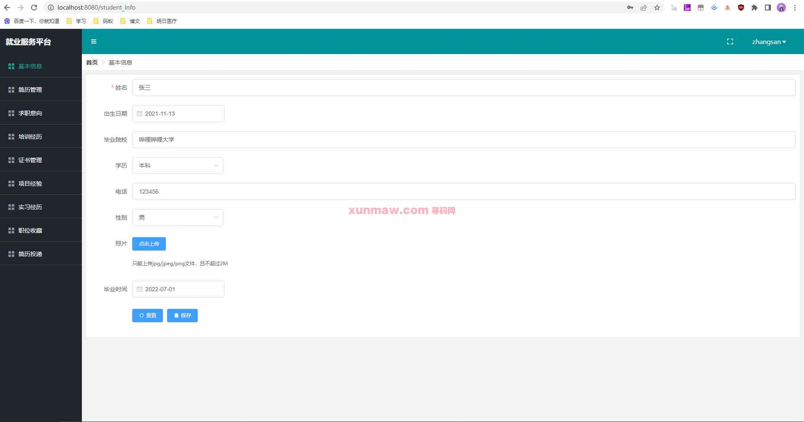

15. 学生端-简历管理  

16. 学生端-求职意向  
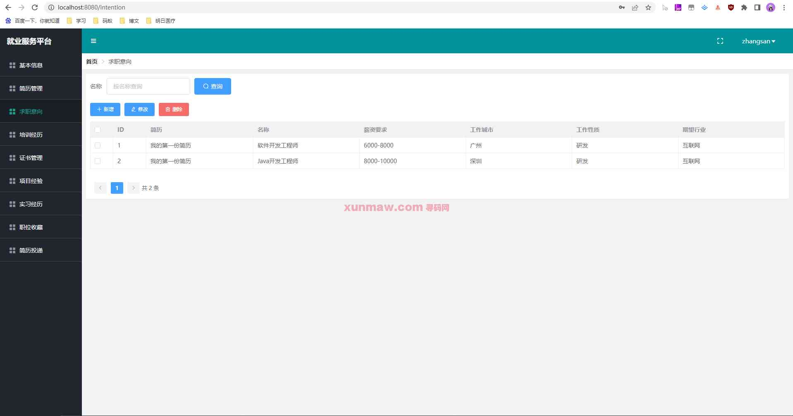

17. 学生端-培训经历  
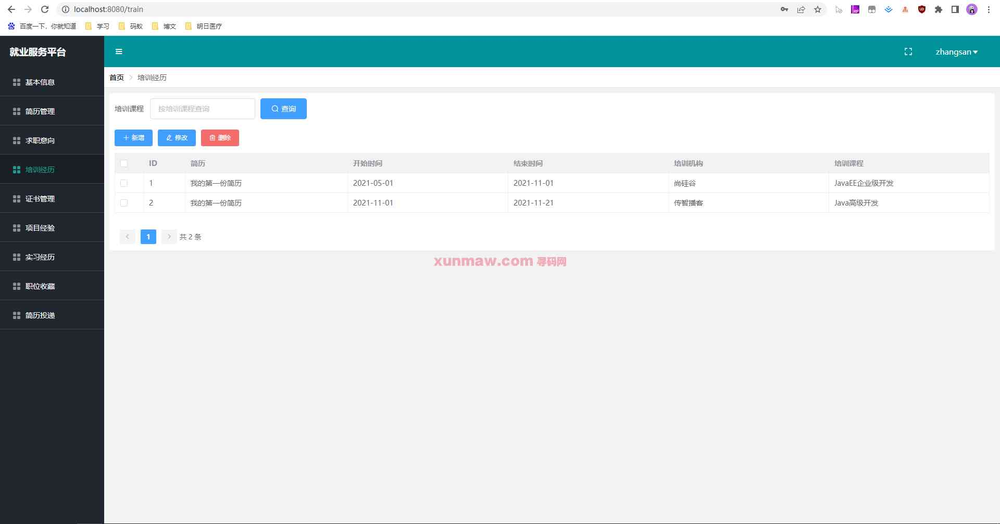

18. 学生端-证书管理  
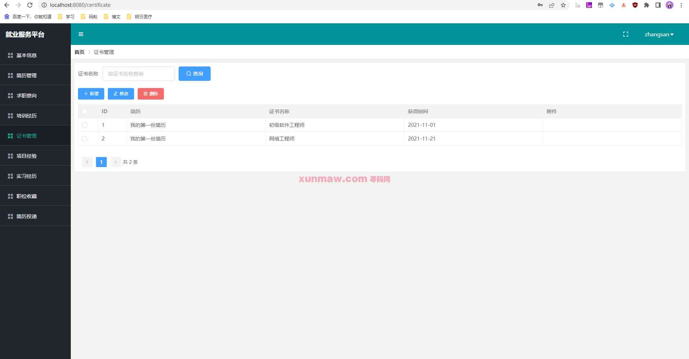

19. 学生端-项目经验  
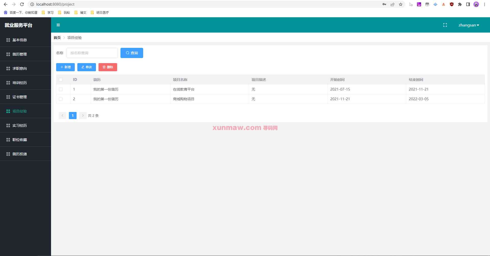

20. 学生端-实习经历  

21. 学生端-简历投递  

22. 学生端-职位收藏  
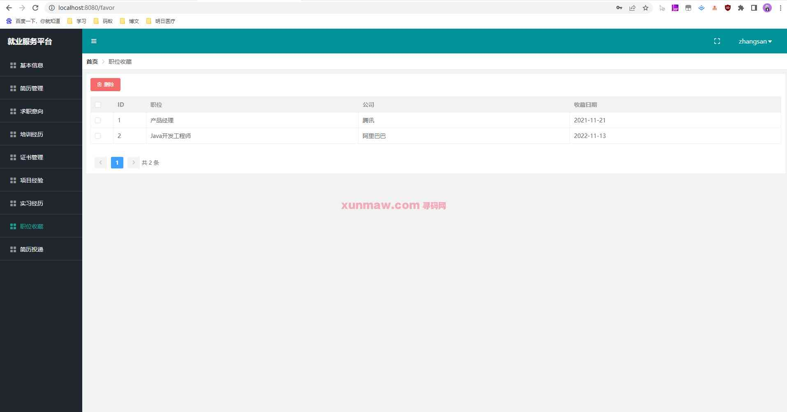

#### 使用说明
1. 创建数据库，执行数据库脚本  
2. 修改jdbc数据库连接参数  
3. 下载安装maven依赖jar  
4. 启动SpringBoot启动类  

后端管理：   
    请求地址： http://localhost:8080   
    用户名：admin      
    密码：123456      